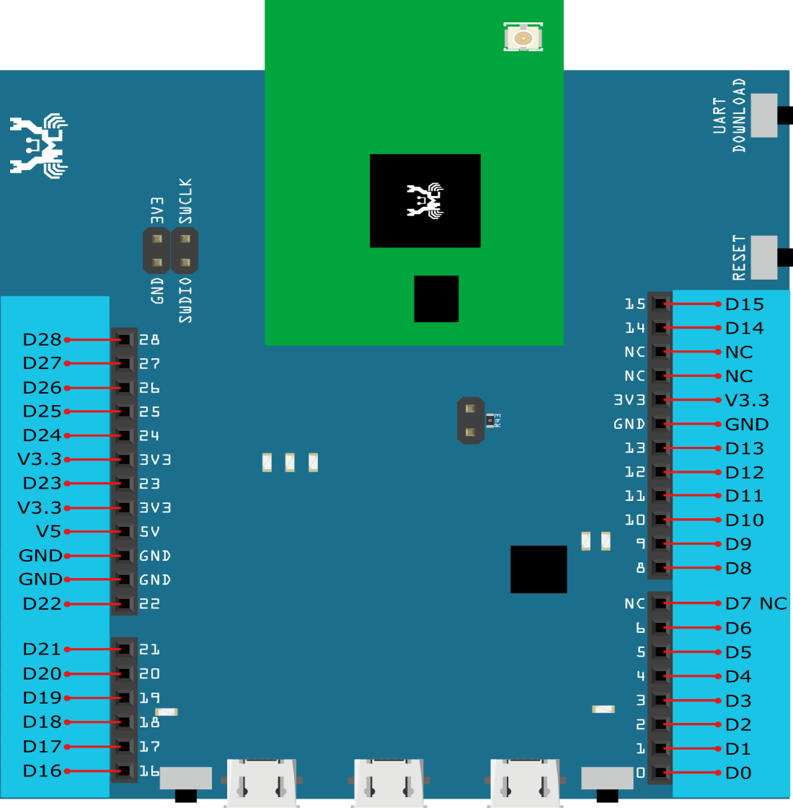
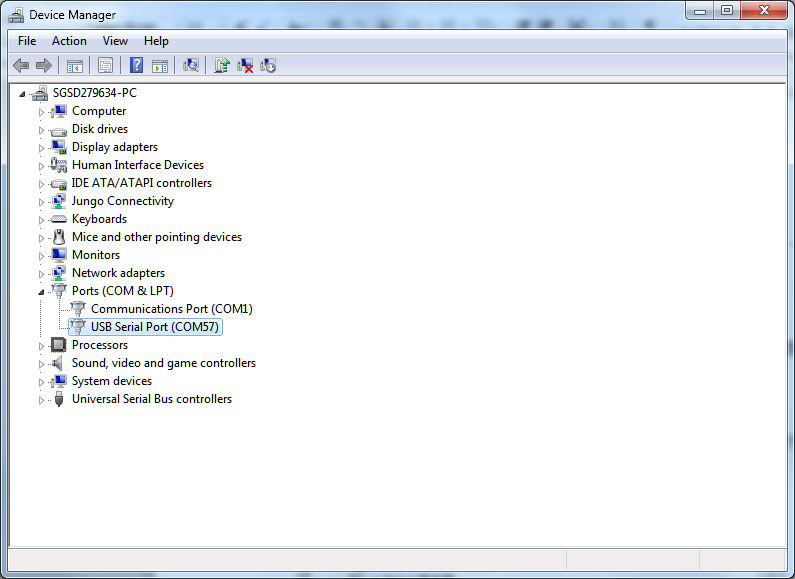
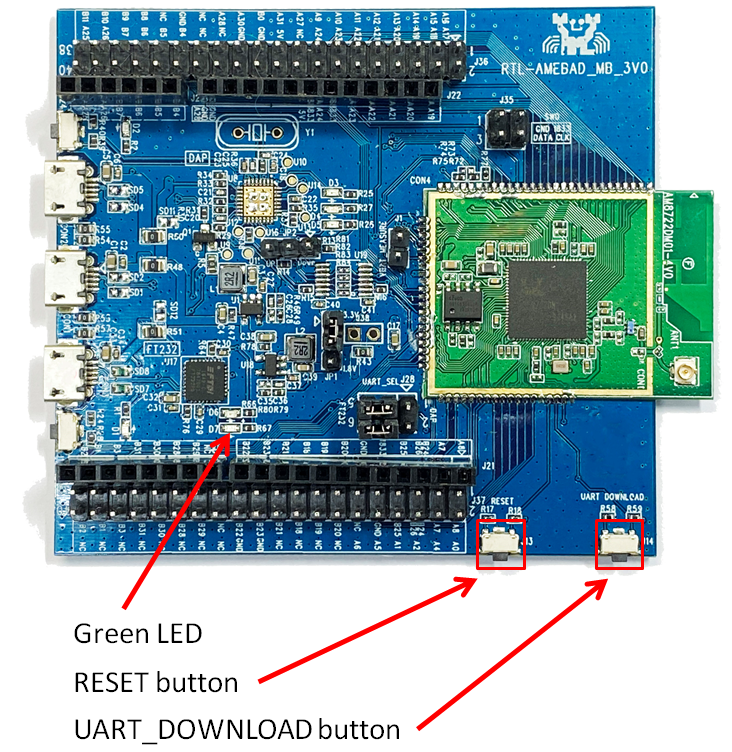
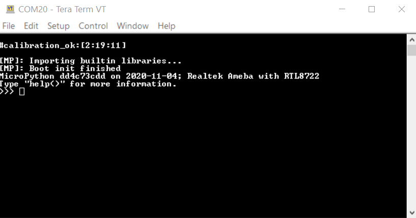

#############
快速入門手冊
#############

********
環境配置
********

AmebaD RTL8722CSM/RTL8722DM MicroPython SDK 目前支持 Windows 10 和 Linux 操作系統。

AmebaD RTL8722CSM/RTL8722DM介紹
===========================================

Ameba是一個易於編程的微控制器平台，可用於開發各種物聯網應用程序。 AmebaD有各種外圍接口，包括WiFi, BLE, GPIO, I2C, UART, SPI, PWM, ADC。通過這些接口，AmebaD可以連接LED、開關、壓力計、濕度計、PM2.5粉塵傳感器等電子元件。

Ameba所收集的數據可以通過WiFi無線上傳，並被智能設備上的應用程序使用，實現物聯網的應用。

|get-start-1|

AmebaD和Arduino Uno的尺寸類似，如上圖所示，並且AmebaD上的引腳與Arduino Uno兼容。

AmebaD使用Micro USB來供電，這在許多智能設備中很常見。

AmebaD的引腳圖和功能請參考下圖和表格。

|get-start-2|

.. table:: 
   :align: center

   ===  ========  ====  ==== ===== ============== ========= ========
   |    PIN name  GPIO  ADC  PWM   UART           SPI       I2C
   ===  ========  ====  ==== ===== ============== ========= ========
   D00  GPIOB_2   ✓     ADC5       UART3_RX(b)              
   D01  GPIOB_1   ✓     ADC4       UART3_TX(b)              
   D02  GPIOB_3   ✓     ADC6                                
   D03  GPIOB_31  ✓                                            
   D04  GPIOB_30  ✓                                            
   D05  GPIOB_28  ✓                                            
   D06  GPIOB_29  ✓                                            
   D07  NC                                                    
   D08  GPIOB_22  ✓          PWM14                          
   D09  GPIOB_23  ✓          PWM15                          
   D10  GPIOB_21  ✓          PWM13 UART0_RTS(b)   SPI0_CS    
   D11  GPIOB_18  ✓          PWM10 UART0_RX(b)    SPI0_MOSI  
   D12  GPIOB_19  ✓          PWM11 UART0_TX(b)    SPI0_MISO  
   D13  GPIOB_20  ✓          PWM12 UART0_CTS(b)   SPI0_CLK   
   D14  GPIOA_7   ✓                UART2_TX(log)            
   D15  GPIOA_8   ✓                UART2_RX(log)            
   D16  GPIOA_25  ✓          PWM4  UART3_RX(a)              I2C0_SCL
   D17  GPIOA_26  ✓          PWM5  UART3_TX(a)              I2C0_SDA
   D18  GPIOB_7   ✓     ADC3 PWM17                SPI1_CS    
   D19  GPIOB_6   ✓     ADC2                      SPI1_CLK   
   D20  GPIOB_5   ✓     ADC1 PWM9                 SPI1_MISO  
   D21  GPIOB_4   ✓     ADC0 PWM8                 SPI1_MOSI  
   D22  GPIOA_28  ✓                                            
   D23  GPIOA_24  ✓          PWM3  UART0_CTS(a)             I2C1_SDA
   D24  GPIOA_23  ✓          PWM2  UART0_RTS(a)             I2C1_SCL
   D25  GPIOA_22  ✓                UART0_RX(a)              
   D26  GPIOA_21  ✓                UART0_TX(a)              
   D27  GPIOA_20  ✓                                            
   D28  GPIOA_19  ✓                                            
   ===  ========  ====  ==== ===== ============== ========= ========

|get-start-3|
 
.. Note::
   | 上圖/表中顯示的並非所有外圍設備都可以在MicroPython上使用，
   | 請參閱 “:doc:`../api_documents/index`” 部分以獲取更多資訊。

RTL8722 MicroPython 移植簡介
========================================

基本背景
----------------------

根據定義，MicroPython是專門為微控制器設計的精簡高效的 ``Python3`` 編譯器。

MicroPython 透過內建功能- ``REPL`` 與Microcontroller進行即時交互的方法，將其與其他基於編譯的平台（Arduino等）區分開來。

``REPL`` 代表Read-Evaluation-Print-Loop，它是一個交互式提示，可用於存取和控制微控制器。

``REPL`` 具有其他強大的特色，例如tab處理，行編輯，自動縮排，輸入歷史記錄等。 它的基本功能類似於標準的 Python IDLE，但是運行在微控制器上。

要使用 ``REPL`` ，只需在PC上打開任何串行終端軟件（最常用的工具是 **TeraTerm, Putty** 等），然後連接到微控制器的串行端口，然後將波特率設置為 ``115200``，然後手動重置開發板，即可看到 ``>>>`` MicroPython提示符出現在終端畫面上。 您就可以在REPL上輸入任何Python腳本。

建議多嘗試使用 “ ``help()`` ” 函數以獲得更多資訊。  

例如，微控制器上電並顯示REPL後，只需鍵入

>>> help()

| 您將看到一個幫助頁面，為您提供有關此移植的更多詳細信息。
| 如果您輸入

>>> help(modules)

| 它將列出所有可用的內建模塊供您使用。
| 此外，如果您想了解有關模塊的更多資訊，例如可用的API和CONSTANT，只需鍵入以下代碼

>>> help(您感興趣的模塊)

來獲取該模塊的詳細信息。

讓我們以Pin模塊（GPIO）為例：

.. code-block:: python

   >>> help(Pin)

   object <class 'Pin'> is of type type
   id -- <function>
   init -- <function>
   value -- <function>
   off -- <function>
   on -- <function>
   toggle -- <function>
   board -- <class 'board'>
   IN -- 0
   OUT -- 1
   PULL_NONE -- 0
   PULL_UP -- 1
   PULL_DOWN -- 2

REPL 快捷鍵
------------

-  ``Ctrl + B``

   此快捷鍵會將 ``REPL`` 重置為普通模式， 您可以利用該指令解決某些模式下的卡死。

-  ``Ctrl + C``

   此熱鍵可幫助您快速取消任何輸入並另起一行

-  ``Ctrl + D``

   MicroPython將執行軟件重啟，這在您的微控制器表現異常時非常有用。並且將再次執行 “boot.py” 中的腳本。請注意，這只會重置MicroPython interpreter 而不重置硬件，所有先前配置的硬件將保持原樣，直到您手動重置開發板為止。

-  ``Ctrl + E``

   此快捷鍵會將 ``REPL`` 設置粘貼模式，在粘貼模式下，可以一次將一大部分的代碼粘貼到REPL中，而無需一行一行地執行代碼。 適合當您找到MicroPython庫並希望通過複製和貼上立即對其進行測試時。

設置開發環境
==================================

步驟1: 安裝驅動程序
---------------------

首先，通過Micro USB將AmebaD連接到電腦:

|get-start-4|

| 如果這是您第一次將AmebaD連接到您的電腦，那麼AmebaD的USB驅動程序將自動安裝。
| 如果遇到開發板連接到電腦的驅動程序問題，請參考下列 USB 驅動安裝程序 https://ftdichip.com/drivers/
| 你可以在你的電腦的裝置管理員中檢查COM端口號:
   
|get-start-5|

步驟2: 安裝相關工具
---------------------

Windows環境
^^^^^^^^^^^^^

對於Windows用戶，請安裝串行終端軟件。 最常見的串行終端是 ``Tera Term`` 和 ``Putty``，在這裡我們建議使用 ``Tera Term`` ，可以從網路下載。

對於希望從頭開始編譯MicroPython的用戶，請確保安裝 ``Cygwin``，這是在Windows系統上運行的類似Linux的環境。 
選擇 ``Cygwin`` 安裝程序時，我們建議使用 ``Cygwin`` 32位元版本。 
在  ``Cygwin`` 安裝期間，安裝程序將提示用戶是否安裝其他軟件，請確保從“ ``Devel`` ”類別中選擇 ``make`` 的GNU版本（請參見下圖），然後選擇最新版本。

|get-start-6|

另外，在固件編譯過程中需要 Python3，因此請確保從其官方網站下載最新的 Python3，並在安裝過程中要求時將其添加為環境變量。

Linux環境
^^^^^^^^^^^^^

對於Linux用戶，請使用  ``apt-get`` 安裝命令安裝您選擇的串行終端軟件。 在這裡，我們建議使用 ``picocom`` 。

對於有興趣在C語言中開發 MicroPython 模塊的用戶，請確保安裝了至少 3.82 或更高版本的 GNU make 軟件以及 Python3。

************************
將固件上傳到Ameba
************************

步驟1: 找到 “Release” 文件夾
==============================

從 `GitHub`_ 下載 MicroPython repository 後，會在根目錄中看到一個 ``“Release”`` 文件夾，並且在該路徑下找到一個名為 ``“Double-Click-Me-to-Upload”`` 的工具。

.. _GitHub: https://github.com/ambiot/ambd_micropython

步驟2: 進入 UART 下載模式
==============================

請先按住 ``UART_DOWNLOAD`` 按鈕，然後按 ``RESET`` 按鈕。 如果成功，您應該在 Ameba 上看到綠色的 LED 閃爍。

|get-start-7|

步驟3: 運行 “Double-Click-Me-to-Upload”
=========================================

顧名思義，雙擊該文件以運行它，然後按照屏幕上顯示的說明更新 Ameba 的串行COM端口，這樣上傳就可以成功進行。 上傳成功後，您將在屏幕上看到一行日誌 – “All images are sent successfully”。

************************
嘗試第一個範例
************************

步驟1: 打開 REPL
================

REPL 代表 讀取(Read) ，評估(Evaluation) ，打印(Print) 和 循環(Loop)，它是 MicroPython 的終端，供用戶控制微控制器。 
REPL在LOG UART上運行，因此我們需要打開串行終端軟件，在本例中為Tera Term，用以查看REPL。

|get-start-8|

打開Tera Term後，如上圖所示選擇“Serial”，然後使用下拉列表選擇 Ameba 的串行端口，然後單擊“OK”。 如果您的串行終端未配置為 ``115200`` 波特率，建議將 ``115200`` 設定為默認設置。

現在已經連接了串行端口，在 Ameba 上按一下 ``RESET`` 按鈕，如下所示會看到 MicroPython 的歡迎頁面。

|get-start-9|

過程為Ameba首先檢查其校準數據，然後啟動MicroPython的固件，接著再運行 ``boot.py`` Python腳本和導入的內建python庫。

現在試著輸入help()

>>> help()

| 查看更多信息，
| 然後輸入

>>> help(modules)

檢查所有現成可用的python庫。

步驟2: 執行WiFi掃描範例
========================

由於大多數外圍設備的範例都需要額外的硬件才能顯示該範例是否正常運行，因此我們將僅以WiFi掃描範例為例，來了解使用MicroPython控制WiFi是十分容易的。

現在，請複製並貼上以下代碼，或手動將其輸入 ``Tera Term`` ，然後按“Enter”。

.. code-block:: python

   from wireless import WLAN
   wifi = WLAN(mode = WLAN.STA)
   wifi.scan()

您應該能夠看到返回周圍無線網絡的結果

|get-start-10|

**(End)**

-------------------------------------------------------------------------------------------------------------------------------------

.. note:: 
   如果遇到任何問題請參考 :doc:`../support/FAQ` 和 :doc:`../support/Trouble shooting` 頁面。

.. |get-start-1| image:: ../media/getting_started/imageGS1.png
   :width: 882
   :height: 881
   :scale: 50 %

.. |get-start-3| image:: ../media/getting_started/imageGS3.png
   :width: 1383
   :height: 690
   :scale: 50 %
.. |get-start-4| image:: ../media/getting_started/imageGS5.png
   :width: 820
   :height: 584
   :scale: 50 %

.. |get-start-6| image:: ../media/getting_started/imageGS7.png
   :width: 1431
   :height: 812
   :scale: 50 %

.. |get-start-8| image:: ../media/getting_started/imageGS9.png
   :width: 819
   :height: 427
   :scale: 50 %

.. |get-start-10| image:: ../media/getting_started/imageGS11.png
   :width: 820
   :height: 472
   :scale: 50 %