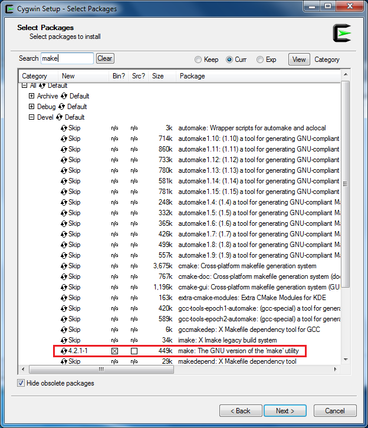
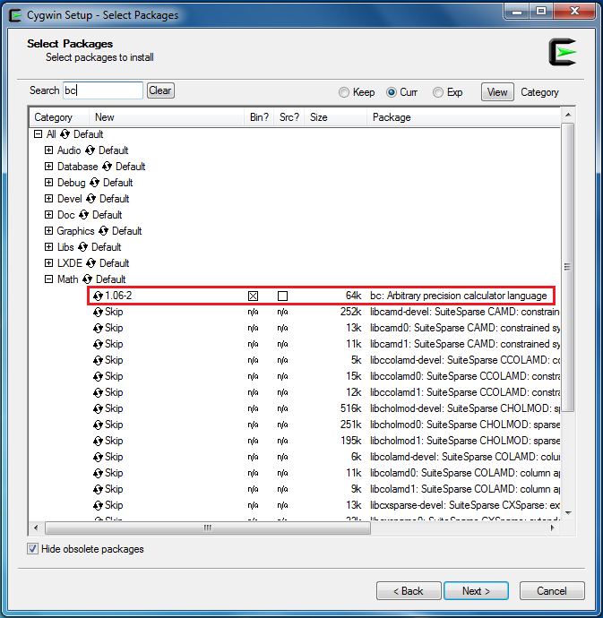
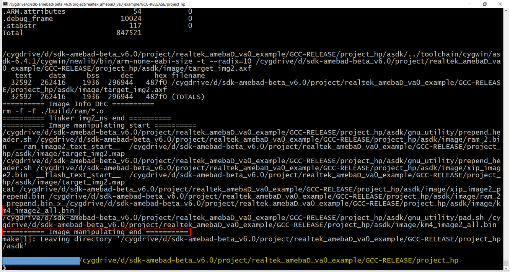
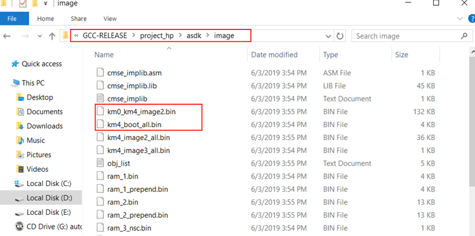
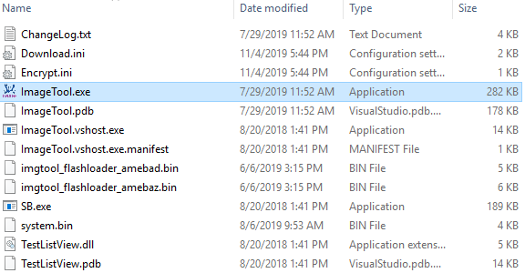
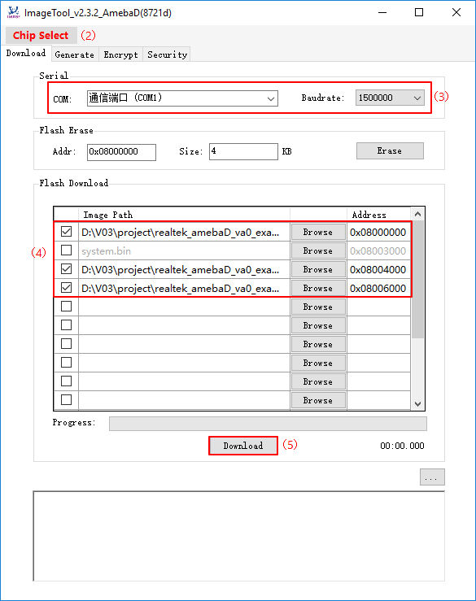

###############
入門指南
###############

*************************
GCC 開發環境的設置
*************************

| 在 Windows 上，可以將 ``Cygwin`` 用作 GCC 開發環境。 Cygwin 是 GNU 和開源工具的集合，類似於提供 Linux 相關的功能在 Windows 平台上使用。 
| 點選 `http://cygwin.com/  <http://cygwin.com/>`__\ 且依照自己的 Windows 平台來下載 `http://cygwin.com/  <http://cygwin.com/>`__\ 。 

| 1. 32位元 Windows 和 64位元 Windows 均支持32位元 ``Cygwin``。 
| 2. 安裝 ``Cygwin`` package 過程中， 如下圖所示在 Select Packages 頁面中選擇 **Devel -> make** 與 **Math -> bc** 功能。

   |image0|

   |image1|

.. Note::
   對於 Linux，請參考 `AN0400 Ameba-D Application Note v12.pdf <https://www.amebaiot.com/zh/sdk-download-manual-8722dm/>`_ 來建立GCC開發環境。 

*************************
Ameba-D 開發板的相關介紹
*************************

| 對於 Ameba-D，有許多類型的芯片組可用，例如 RTL8720CS，RTL8721CSM，RTL8722CSM，RTL8720DN，RTL8720DM，RTL8721DM 和 RTL8722DM。
| 此外，芯片組可以嵌入在 Ameba-D DEV 開發板上且擴展各種 I/O 接口。我們提供了相應的 HDK（硬件開發套件）文檔，請聯繫 RTK 了解更多詳細信息。 

Ameba-D 開發板的硬件圖如下所示： 

   - USB TO UART: 供電和日誌打印 
   - 波特率: 為 115200bps
   - SWD: SWD 介面，用於下載圖像和使用 IAR 進行調試 
   - Reset Button: IAR 完成下載後，重置 Ameba-D 以運行固件

   |image2|

**********
連接串口
**********

| 在 Ameba-D 板上，FTDI 芯片和 FT232 可用於串口和除錯器。 可以使用 ``SecureCRT`` 、``Teraterm`` 與 ``Putty`` 等終端工具查看串口訊息。 

1) 選擇相對應的uart參數且打開連接端口。 
2) 然後按 Ameba 上的重置按鈕，在終端中可以找到一些訊息。

   |image3|

********************************
在 Ameba-D 上建立第一個 GCC 項目
********************************

以下步驟供首次開發人員在現有 RTK SDK 下構建GCC項目。 

| **Building Code** 本節說明如何構建SDK。 
| 首先，您需要切換到 GCC目錄。 對於 Windows，打開 ``Cygwin`` 終端，並使用 ``$ cd`` 命令將目錄更改為 Ameba-D SDK 的 KM0 或 KM4 項目目錄。 

.. Note::
   需要將 ``{path}`` 替換成自己的 SDK 位置，並在 SDK 位置前面添加前綴 ``“cygdrive”``，以便 ``Cygwin`` 可以訪問您的文件系統。

* ``$ cd /cygdrive/{path}/project/realtek_amebaD_va0_example/GCC-RELEASE/project_lp``
* ``$ cd /cygdrive/{path}/project/realtek_amebaD_va0_example/GCC-RELEASE/project_hp``

對於 Linux，請打開自己的終端，然後使用 ``$ cd`` 命令將目錄更改為 Ameba-D SDK 的 KM0 或 KM4 項目目錄。

* ``$ cd /{path}/project/realtek_amebaD_va0_example/GCC-RELEASE/project_lp``
* ``$ cd /{path}/project/realtek_amebaD_va0_example/GCC-RELEASE/project_hp``

要構建一般固件的SDK，只需在Cygwin（Windows）或終端（Linux）上相應目錄下使用命令。 
KM0 project 對於 KM0，如果終端輸出訊息包含 ``“km0_image2_all.bin”`` 和 ``“Image manipulating end”``，則表示固件已成功構建，如下所示。

|image4|

如果構建失敗，請輸入 ``$ make clean`` 然後重新執行 ``make``。 成功構建後，固件檔案位於 ``project/realtek_amebaD_va0_example/GCC-RELEASE/project_lp/asdk/image`` 下，如下圖所示。

|image5|

KM4 project 對於 KM4，如果終端輸出訊息包含 ``“km0_image2_all.bin”`` 和 ``“Image manipulating end”``，則表示固件已成功構建，如下所示。

|image6| 

如果構建失敗，請輸入 ``$ make clean`` 然後重新執行 make。 成功構建後，固件檔案位於 ``project/realtek_amebaD_va0_example/GCC-RELEASE/project_hp/asdk/image`` 下，如下圖所示。

|image7|

******************************
下載固件至 Ameba-D Realtek
****************************** 

提供了 Image Tool 在 Windows 中可以方便下載固件

  * 環境需求: WinXP, Win 7 以上, Microsoft .NET Framework 3.5
  * ``ImageTool.exe`` 位置: ``SDK\tools\AmebaD\Image_Tool\ImageTool.exe``

   |image8|

假設 PC 上的 Image Tool 是服務器，它將通過 UART 將固件檔案發送到 Ameba（客戶端）。 要將檔案從服務器下載到客戶端，客戶端必須首先進入 UART download 模式。 

1) **進入 UART_DOWNLOAD 模式**

   * 按下 UART DOWNLOAD 按鈕並保持按下狀態
   * 重新打開電源，或按重置按鈕
   * 放開 UART DOWNLOAD 按鈕
  
   現在Ameba 板 進入 UART_DOWNLOAD 模式並準備接收數據。 

2) **點選 UI上 的 Chip Select（紅色），然後選擇芯片（AmebaD 或 AmebaZ）**
   
3) **選擇相應的串行端口和傳輸波特率， 默認波特率是 1.5Mbps（推薦）**
   
4) **點選瀏覽按鈕以選擇要編程的固件（km0_boot_all.bin / km4_boot_all.bin / km0_km4_image2.bin）與其位址**
   
   * 固件位址為 ``{path}\project\realtek_amebaD_va0_example\GCC-RELEASE\project_hp\asdk\image`` 與 ``{path}\project\realtek_amebaD_va0_example\GCC-RELEASE\project_hp\asdk\image``。 ``{path}`` 為自己電腦上項目的位址。
   * 默認目標地址是SDK默認固件地址，您可以直接使用它。

5) **點選下載按鈕 進度條將顯示每個固件的傳輸進度並且可以從日誌窗口獲取操作成功消息或錯誤消息。**

   |image9|

.. |image2| image:: ../media/getting_started/image3.png
   :width: 858
   :height: 633
   :scale: 80 %
.. |image3| image:: ../media/getting_started/image4.png
   :width: 1017
   :height: 700
   :scale: 80 %
.. |image4| image:: ../media/getting_started/image5.png
   :width: 731
   :height: 421
   :scale: 100 %
.. |image5| image:: ../media/getting_started/image6.png
   :width: 801
   :height: 375
   :scale: 100 %

